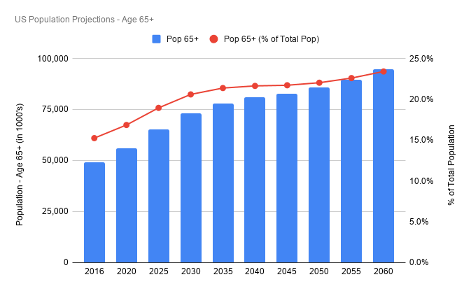
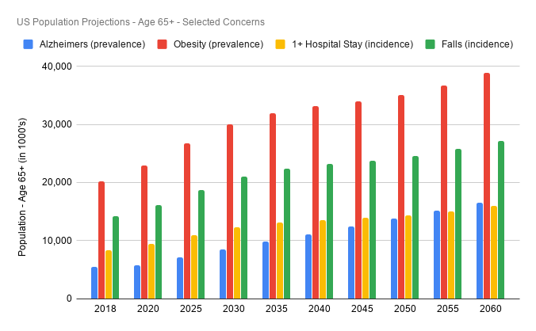

# Research on Aging

## What does aging look like?

There's a version of aging that popular media is selling us: the active retiree couple who travels a lot, spends leisure time with grandchildren, and volunteers in the community. The reality is that for most people, growing older may fit this rosy picture for a little while, but the vast majority of life as an older person will be much more difficult.

*Terminology note: "older adults" and "older persons" refer to people 65+ in age*

Aging presents its own set of unique challenges that we aren't prepared to experience. After a lifetime of training ourselves to rely on our physical and cognitive functions, these functions begin to diminish and fail. Less mobile, we find ourselves confined to our homes or relying on others for our mobility. Less cognitively able, we find ourselves less confident and easy prey for financial predators. Less physically able, we find it difficult to keep up with the day-to-day and those around us.

On average, Americans will spend 17% of their lives as an older person [A]. For a great fraction of the older adult population, this last 17% of life will be an experience that isn't great, with nearly 1 person in 3 suffering from arthritis; 1 in 10 suffering from Alzheimers; 1 in 7 suffering from depression [B]. 40% of the population will be obese and nearly a third will fall resulting in injury and potential hospitalization [C].

## The population of older adults is large, and growing

As a species, we're getting better at living longer [D]. Coupled with a global decline in birth rate, especially in developed nations, the population of humans is getting older [E, F]. In the US, in particular, the population of older adults stood at 50.9mm people (15.6% of the population - every 1 in 7 people) in 2017 [G1]. As of 2018, The US Census projects that number to reach 94.7mm people (23.4% of the population - almost 1 in 4 people) by 2060 [G2]. The population of older adults is expected to grow 30.5%, from 56.0mm to 73.1mm people, over the next decade. [H]

## The problems that come with aging are widespread and costly

Major problems will afflict the majority of older adults. Today, 41% of older adults are Obese; 11% have Alzheimers; 29% will be injured from a fall (most of these falls take place at home); and 17% will have at least one hospital stay over the course of a year. [C]

Per capita personal healthcare spend for older adults was $19k in 2014 (the latest year for which data is available) -- more than 5x that of children and almost 3x that of working-age people (age 18-64). [I] Not only are the problems associated with aging draining the vitality from older persons', it's also draining their pocketbooks.

## Can we age better?

Aging is going to happen. No one is immune. But how can we age better? How can we make that last 17% of life as full of vitality, fulfillment, purpose as possible? What does healthy longevity look like?

Even small improvements can be greatly impactful given the scale of population, but all the better if improvements are better-than-small.

## References and Notes

* A - Life expectancy for someone born the US in 2017 is 78.6 years, per 4. This hypothetical person would spend 13.6 years as someone over the age of 65 (that is, 78.6 - 65). That 13.6 years represents 17.3% of this person's life. Nearly one in five days of this person's entire life will be spent as an older adult.
* B - [Healthy Facts about Aging - National Council on Aging](https://www.ncoa.org/news/resources-for-reporters/get-the-facts/healthy-aging-facts/)
* C - [Table 2 - US Population of Older Adults - Selected Concerns](https://docs.google.com/spreadsheets/d/1SNpMEMnjWb7BQQBusLco8-r0iHI32Sz4ZdHX0Q57Mls/edit?usp=sharing)
* D - [Life Expectancy at Birth, total (years) - worldbank.org](https://data.worldbank.org/indicator/SP.DYN.LE00.IN)
* E - [Birth Rate, Crude (World) - worldbank.org](https://data.worldbank.org/indicator/SP.DYN.CBRT.IN)
* F - [Fertility Rate - oecd.org](https://data.oecd.org/pop/fertility-rates.htm)
* G - [2018 Profile of Older Americans - acl.gov](https://acl.gov/sites/default/files/Aging%20and%20Disability%20in%20America/2018OlderAmericansProfile.pdf)
  * G1 - pg 4 "The Older Population"
  * G2 - pg 5 "Future Growth"
* H - [Table 1 - US Population of Older Adults](https://docs.google.com/spreadsheets/d/1SNpMEMnjWb7BQQBusLco8-r0iHI32Sz4ZdHX0Q57Mls/edit?usp=sharing)
* I - [National Health Expenditure Fact Sheet - cms.gov](https://www.cms.gov/research-statistics-data-and-systems/statistics-trends-and-reports/nationalhealthexpenddata/nhe-fact-sheet/)
